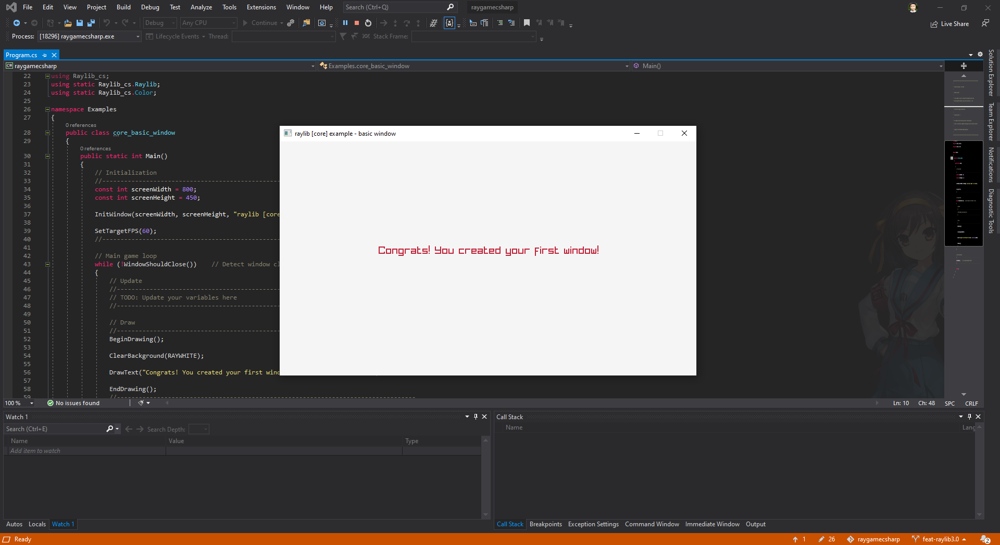

# raygamecsharp - sample project

This is a sample C# project setup with [raylib][raylib] for Visual Studio.
Raylib is a simple game programming framework that is designed to be friendly to
beginners. It is created by [Ramon Santamaria (@raysan5)][raysan].

The language binding is maintained at [ChrisDill/Raylib-cs][raylib-cs] and
is compatible with Raylib 3.0.

It is primarily intended for use by students in the Game Programming course at
the Seattle Campus of the Academy of Interactive Entertainment.

[raylib]:https://github.com/raysan5/raylib
[raysan]:https://github.com/raysan5

## Building

This project supports by **Visual Studio 2019** or newer.

> This is written against .NET Core 3.1 and primarily supports Windows.
> Adjustments may be needed for other platforms.

Clone the repository and open the solution in Visual Studio. Both the solution
and project should already be configured and ready to start working with. To
test this, build and run the provided sample project.

The sample project that is provided is the [basic window example][basicexample]
from raylib. Further examples can be found in its [repository][rayexample].

A full list of all methods and types made available via the [binding can be
found in the Raylib-cs repository][raylib-cs-bindings].

[basicexample]:https://github.com/ChrisDill/Raylib-cs-Examples/blob/master/Examples/core/core_basic_window.cs
[rayexample]:https://github.com/ChrisDill/Raylib-cs-Examples
[raylib-cs]:https://github.com/ChrisDill/Raylib-cs
[raylib-cs-bindings]:https://github.com/ChrisDill/Raylib-cs/blob/master/Raylib-cs/Raylib.cs

## License

MIT License - Copyright (c) 2019-2020 Academy of Interactive Entertainment

For more information, see the [license][lic] file.

Third party works are attributed under [thirdparty.md][3p].

[lic]:LICENSE.md
[3p]:THIRDPARTY.md
[raylib]:https://github.com/raysan5/raylib
